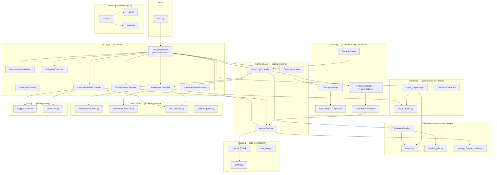
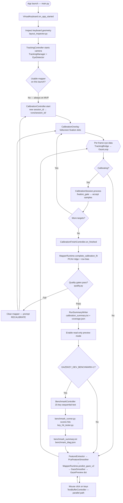
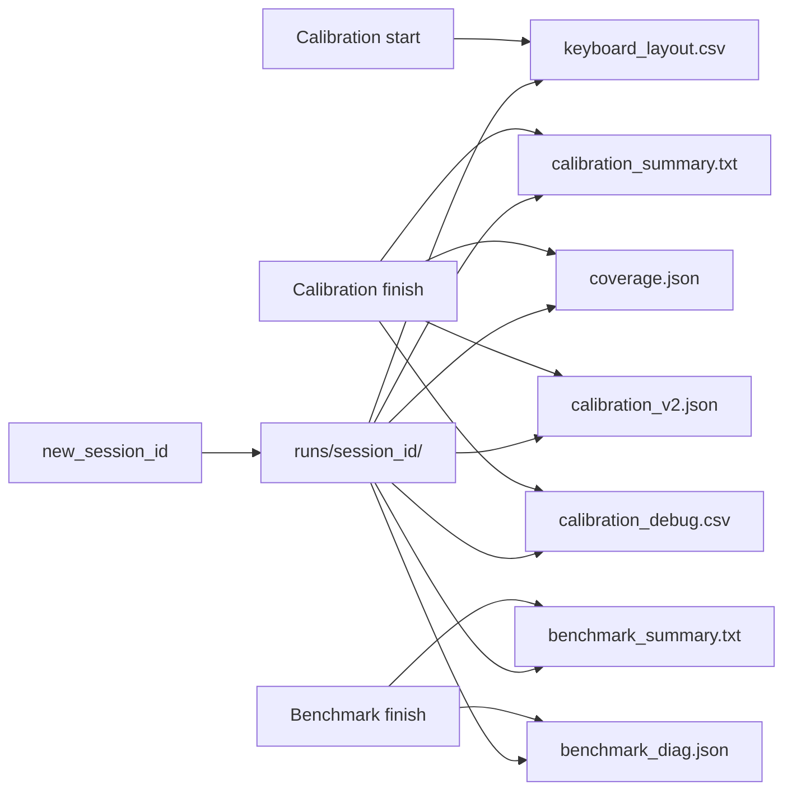

# GazeKey — Project Structure & Critical Flow

**Last updated:** 2026-07-06  
**Scope:** Full repository layout, module roles, and the **central MVP runtime path** only.

Related references: [`CURRENT_PIPELINE.md`](../CURRENT_PIPELINE.md) (step-by-step runtime), [`gazekey_code_structure.md`](./gazekey_code_structure.md) (per-file module map), [`specs/001-calibration-mapping-mvp/plan.md`](../specs/001-calibration-mapping-mvp/plan.md) (feature design).

---

## 1. System purpose

GazeKey is a **desktop webcam eye-tracking virtual keyboard**. The current MVP answers one question:

> After calibration, does mapped gaze land on the correct virtual-keyboard key?

The active path is a single linear pipeline:

```text
tracking → features → calibration → mapping → preview → (optional dev benchmark)
```

Mouse click typing works today. Gaze-based dwell typing, intent scoring, and OS injection are **out of scope** until mapping accuracy is proven.

---

## 2. Repository structure chart

```text
Virtual Keyboard/
│
├── main.py                          # Application entry point
├── requirements.txt                 # Python dependencies
├── CURRENT_PIPELINE.md              # Authoritative runtime narrative
├── TYPING_CANDIDATE.md              # Frozen mapper / gate configuration notes
│
├── gazekey/                         # ★ Core application package (see §4)
│   ├── tracking/                    # Webcam + MediaPipe eye detection
│   ├── features/                    # EyeData → FrameFeatures + smoothing
│   ├── calibration/                 # Target collection, fixation, quality
│   ├── mapping/                     # PCA4 ridge gaze mapper
│   ├── runtime/                     # Fit/predict orchestration, gaze loop
│   ├── layout/                      # Keyboard key geometry
│   ├── ui/                          # PySide6 shell + controllers
│   ├── evaluation/                  # Benchmark scoring, run summaries
│   ├── typing/                      # Hit testing, text buffer, gaze smoother
│   ├── debug/                       # Offline inspection exports
│   ├── future/                      # Dormant gaze-interaction facade
│   ├── intent/                      # Key intent scoring (dormant)
│   └── selection/                   # Selection policy (dormant)
│
├── tests/                           # Pytest suite (unit + integration)
│   ├── unit/                        # Module contract tests
│   └── integration/                 # End-to-end MVP pipeline tests
│
├── runs/                            # Per-session artifacts (runtime output)
│   └── <session_id>/                # calibration_summary, benchmark_diag, etc.
│
├── models/                          # MediaPipe face_landmarker.task (runtime)
│
├── scripts/                         # Offline dev demos & analysis (not in app flow)
├── archive/                         # Legacy v1 calibration + experiment mappers
├── docs/                            # Project documentation
├── specs/                           # Spec Kit feature specs & contracts
└── .specify/                        # Spec Kit tooling, constitution, templates
```

---

## 3. Layer architecture (logical departments)



---

## 4. Critical runtime flowchart (MVP path)

This is the **only user-facing flow** that matters for the current MVP. Dev benchmark and debug exports are optional branches.



### Critical path summary (numbered)

| Step | Department | What happens |
|------|------------|--------------|
| 1 | Entry + UI | App starts; `VirtualKeyboard` wires all controllers |
| 2 | Layout | Key centers and hitboxes captured from live Qt widgets |
| 3 | Tracking | Background thread captures webcam → `EyeData` via MediaPipe |
| 4 | Calibration | User fixates 15 dots; samples gated by fixation stability |
| 5 | Mapping | PCA4 ridge fit on calibration means; optional row-Y bias applied |
| 6 | Quality | Sanity gates decide if preview/benchmark are allowed |
| 7 | Preview | Mapped gaze dot drawn read-only on keyboard (no key activation) |
| 8 | Benchmark (dev) | Optional 15-key accuracy test with pass/fail scoring |
| 9 | Artifacts | Session folder under `runs/<session_id>/` records outcomes |

---

## 5. Roles & responsibilities by department

### 5.1 Entry & shell

| Object | Location | Role | Responsibilities |
|--------|----------|------|------------------|
| **Application entry** | `main.py` | Bootstrap | Create `QApplication`, instantiate `VirtualKeyboard`, start Qt event loop |
| **VirtualKeyboard** | `gazekey/ui/virtual_keyboard.py` | Thin orchestrator | Window lifecycle; wire controllers; own shared state (mapper, session, flags); **must not** contain mapping math or benchmark scoring |
| **KeyboardLayoutBuilder** | `gazekey/ui/keyboard_layout.py` | UI chrome | Build key grid, control bar, text field, suggestion placeholders; responsive geometry |
| **EnvFlags** | `gazekey/ui/env_flags.py` | Configuration | Read `GAZEKEY_*` environment variables (verbose, dev benchmark, calib mode) |
| **mvp_log** | `gazekey/mvp_log.py` | Logging | Quiet-by-default status lines; verbose detail when `GAZEKEY_VERBOSE=1` |

### 5.2 Sensing (tracking + features)

| Object | Location | Role | Responsibilities |
|--------|----------|------|------------------|
| **TrackingManager** | `gazekey/tracking/tracking_manager.py` | Capture orchestrator | Own webcam thread; coordinate frame capture and eye detection |
| **VideoCapture** | `gazekey/tracking/video_capture.py` | Hardware I/O | Read frames from webcam at ~30 FPS |
| **EyeDetector** | `gazekey/tracking/eye_detector.py` | Landmark extraction | MediaPipe face mesh → iris centers, face pose → `EyeData` |
| **TrackingBridge** | `gazekey/tracking/tracking_bridge.py` | Thread safety | Emit `EyeData` from worker thread to Qt main thread via signal |
| **TrackingController** | `gazekey/runtime/tracking_controller.py` | Lifecycle | Start/stop camera; connect bridge to gaze loop |
| **FeatureExtractor** | `gazekey/features/extractor.py` | Feature engineering | Convert `EyeData` → `FrameFeatures` (PCA u/v components, ratios, quality) |
| **PcaFeatureSmoother** | `gazekey/features/feature_smoother.py` | Temporal filter | EMA smooth PCA features at runtime (`FEATURE_SMOOTHER_ALPHA`) |
| **FrameFeatures** | `gazekey/features/feature_types.py` | Data contract | Typed container for per-frame gaze features |

### 5.3 Geometry & layout

| Object | Location | Role | Responsibilities |
|--------|----------|------|------------------|
| **layout_inspector** | `gazekey/layout/layout_inspector.py` | Geometry source of truth | Snapshot Qt key widgets → centers, rows, hitboxes (`KeyGeometryRow`) |
| **targets.py** | `gazekey/calibration/targets.py` | Calibration layout | Define fixation target positions (default `keyboard15`; 9/13 variants via env) |
| **key_hit_tester** | `gazekey/typing/key_hit_tester.py` | Hit testing | Map screen (x,y) to key id for benchmark scoring |
| **gaze_ui_mapper** | `gazekey/typing/gaze_ui_mapper.py` | Region mapping | Screen bounds → keyboard sub-regions |
| **KeyboardLayoutCsvExporter** | `gazekey/debug/layout_csv.py` | Debug export | Write `keyboard_layout.csv` to session folder |

**Critical rule:** Calibration targets, preview clamp bounds, and benchmark hit tests **must share the same geometry snapshot**.

### 5.4 Calibration

| Object | Location | Role | Responsibilities |
|--------|----------|------|------------------|
| **CalibrationController** | `gazekey/ui/calibration_controller.py` | Session UI coordinator | Start session, bind `session_id`, show overlay |
| **CalibrationOverlay** | `gazekey/ui/calibration_overlay.py` | Fixation UI | Fullscreen dot + progress only (no debug text during fixation — constitution XI) |
| **CalibrationSession** | `gazekey/calibration/session.py` | Sample collection | Per-target fixation sequence; accumulate accepted feature means |
| **fixation_gate** | `gazekey/calibration/fixation_gate.py` | Quality gate (collection) | Reject unstable fixations, head drift, low-quality frames |
| **outliers** | `gazekey/calibration/outliers.py` | Peer validation | Flag outlier targets among collected means |
| **quality.py** | `gazekey/calibration/quality.py` | Post-fit usability | Decide if mapper is usable for preview/benchmark |
| **region_quality.py** | `gazekey/calibration/region_quality.py` | Supplementary gate | Per-target LOOCV checks (not sole acceptance criteria) |
| **CalibrationFinishController** | `gazekey/ui/calibration_finish.py` | Finish orchestration | Trigger fit, write summaries, export debug CSVs |

**Calibration vs benchmark:** Calibration **learns** the mapping on fixation targets. Benchmark **validates** on a fixed held-out 15-key set (`DEFAULT_SAMPLE_KEYS`).

### 5.5 Mapping

| Object | Location | Role | Responsibilities |
|--------|----------|------|------------------|
| **config.py** | `gazekey/mapping/config.py` | Frozen MVP constants | Ridge α grid, gate thresholds, smoother alphas, default layout mode |
| **ridge.py** | `gazekey/mapping/ridge.py` | Core mapper | `fit_calibration_mapper()` → `Pca4BaselineMapper` on PCA u/v features |
| **row_bias.py** | `gazekey/mapping/row_bias.py` | Post-fit correction | Optional per-row Y bias wrapper (`APPLY_ROW_Y_BIAS`) |
| **base.py** | `gazekey/mapping/base.py` | Abstractions | `Mapper`, `MapperPrediction`, `MapperFitResult` interfaces |
| **MapperRuntime** | `gazekey/runtime/mapper_runtime.py` | Runtime owner | Fit after calibration; `predict_gaze_v2`; clamp to keyboard region |

**Active mapper:** `pca4_baseline` only. Poly12, IDW, decoupled, and v1 affine mappers live in `archive/`.

### 5.6 Runtime dispatch

| Object | Location | Role | Responsibilities |
|--------|----------|------|------------------|
| **GazeLoopController** | `gazekey/runtime/gaze_loop.py` | Per-frame router | Dispatch eye data to: calibration **or** benchmark **or** read-only preview |
| **GazePreviewController** | `gazekey/ui/gaze_preview.py` | Visual feedback | Draw gaze dot on keyboard (read-only) |
| **GazeSmoother** | `gazekey/typing/gaze_smoother.py` | Screen smoothing | EMA on mapped screen coordinates for stable dot |
| **CameraPreviewWindow** | `gazekey/ui/camera_preview_window.py` | Webcam PiP | Optional floating camera preview (hidden during calibration by default) |

### 5.7 Evaluation & artifacts

| Object | Location | Role | Responsibilities |
|--------|----------|------|------------------|
| **new_session_id** | `gazekey/evaluation/session.py` | Identity | Generate unique session folder name per launch |
| **session_paths** | `gazekey/evaluation/session_paths.py` | Path contract | Canonical filenames under `runs/<session_id>/` |
| **RunSummaryWriter** | `gazekey/evaluation/run_summary.py` | Human-readable output | Console pass/fail blocks + `calibration_summary.txt` / `benchmark_summary.txt` |
| **BenchmarkController** | `gazekey/ui/benchmark_controller.py` | Benchmark UI | Highlight keys sequentially; dev-only (`GAZEKEY_DEV_BENCHMARK=1`) |
| **BenchmarkEvalSession** | `gazekey/evaluation/benchmark_session.py` | Timed collection | Per-key settle and sample windows during benchmark |
| **benchmark_runner** | `gazekey/evaluation/benchmark_runner.py` | Scoring | 15-key hit accuracy, pixel error, row accuracy, pass/fail vs SC-001–003 |
| **failure_analysis** | `gazekey/evaluation/failure_analysis.py` | Triage support | Per-key dx/dy, row errors, miss explanations in summary |
| **benchmark_diagnostics** | `gazekey/evaluation/benchmark_diagnostics.py` | JSON detail | Write `benchmark_diag.json` for offline review |
| **coverage_diagnostics** | `gazekey/evaluation/coverage_diagnostics.py` | Coverage report | Hull/extrapolation report → `coverage.json` at cal finish |
| **mapper_store** | `gazekey/debug/mapper_store.py` | Inspection snapshot | Write `calibration_v2.json` (not loaded on startup) |

### 5.8 Typing (partial MVP)

| Object | Location | Role | Responsibilities |
|--------|----------|------|------------------|
| **TextBufferController** | `gazekey/typing/text_buffer.py` | Mouse typing | Update text field from mouse-clicked keys |
| **key_semantics** | `gazekey/typing/key_semantics.py` | Key actions | Map button labels to insert/backspace/shift actions |
| **dwell_selector** | `gazekey/typing/dwell_selector.py` | Dwell timing | **Dormant** — gaze key activation timing |
| **GazeTypingController** | `gazekey/typing/gaze_typing_controller.py` | Gaze typing UI | **Dormant** — dwell-based key press |

### 5.9 Dormant future interaction

| Object | Location | Role | Responsibilities |
|--------|----------|------|------------------|
| **future/** | `gazekey/future/` | Isolation facade | Re-export intent, selection, dwell typing for later reconnection |
| **intent/scoring** | `gazekey/intent/scoring.py` | Key ranking | Score which key user intends to hit |
| **selection/policy** | `gazekey/selection/policy.py` | Hysteresis | Stabilize key selection across frames |

These modules are **preserved but not imported** by the MVP gaze loop.

### 5.10 Debug & offline tooling

| Object | Location | Role | Responsibilities |
|--------|----------|------|------------------|
| **debug/** | `gazekey/debug/` | Inspection | Geometry overlays, layout checks, mapper snapshots — dev-only |
| **scripts/** | `scripts/` | Standalone demos | Camera/MediaPipe experiments; offline mapper analysis |
| **archive/** | `archive/` | Historical code | v1 calibration, poly12/IDW mapper variants — reference only |

### 5.11 Tests

| Object | Location | Role | Responsibilities |
|--------|----------|------|------------------|
| **tests/unit/** | `tests/unit/` | Contract tests | Per-module behavior (benchmark, calibration, preview read-only, geometry) |
| **tests/integration/** | `tests/integration/` | Pipeline tests | End-to-end calibrate → preview → benchmark flow |
| **tests/conftest.py** | `tests/` | Fixtures | Shared pytest setup |

### 5.12 Documentation & governance

| Object | Location | Role | Responsibilities |
|--------|----------|------|------------------|
| **constitution** | `.specify/memory/constitution.md` | Engineering law | Accuracy-first, measurable progress, simple pipeline, MVP scope |
| **specs/** | `specs/001-calibration-mapping-mvp/` | Feature truth | spec.md, plan.md, tasks.md, contracts, data model |
| **runs/** | `runs/<session_id>/` | Evidence store | Per-session calibration/benchmark artifacts for iteration |
| **docs/** | `docs/` | Human docs | Status, structure, product specification PDF |

---

## 6. Session artifact flow



Nothing is written to the repository root — all runtime output goes under `runs/<session_id>/`.

---

## 7. Active vs dormant vs archived

| Classification | Paths | Status |
|----------------|-------|--------|
| **Active MVP** | `main.py`, `gazekey/{tracking,features,calibration,mapping,runtime,layout,ui,evaluation}`, `typing/{key_hit_tester,text_buffer,gaze_smoother,key_semantics}` | Required for calibrate → preview → dev benchmark |
| **Active support** | `gazekey/debug/` (exports), `gazekey/mvp_log.py`, `tests/` | Inspection and verification |
| **Dormant (preserved)** | `gazekey/future/`, `gazekey/intent/`, `gazekey/selection/`, `typing/{dwell_selector,gaze_typing_controller}` | Not on MVP import path |
| **Offline only** | `scripts/`, most `debug/` entry points | Developer tools, not user flow |
| **Archived** | `archive/calibration_v1/`, `archive/mapping_variants/` | Legacy reference; do not wire into active path |
| **Governance** | `specs/`, `.specify/` | Design source of truth |

---

## 8. Environment flags (runtime switches)

| Variable | Department affected | Effect |
|----------|---------------------|--------|
| `GAZEKEY_VERBOSE=1` | Logging | Detailed calibration/runtime logs |
| `GAZEKEY_DEV_BENCHMARK=1` | Evaluation | Auto-run 15-key benchmark after calibration |
| `GAZEKEY_CALIB_MODE` | Calibration | Override target layout (`keyboard9`, `keyboard13`, `keyboard15`, etc.) |
| `GAZEKEY_CALIB_DEBUG=1` | Calibration UI | Verbose overlay + geometry debug |
| `GAZEKEY_CALIB_GEOM_DEBUG=1` | Debug | Post-fit geometry overlay |
| `GAZEKEY_GAZE_DEBUG=1` | Mapping/runtime | Extra gaze predict logs |

---

## 9. Design boundaries (what each layer must NOT do)

| Layer | Must NOT |
|-------|----------|
| **UI (`virtual_keyboard.py`)** | Fit mappers, score benchmarks, implement fixation logic |
| **Calibration** | Load saved mappers from disk on startup; show debug text during fixation |
| **Mapping** | Switch between multiple mapper variants at runtime |
| **Evaluation** | Grow into a diagnostics platform or multi-mapper comparison framework |
| **Preview** | Activate keys or update the text buffer |
| **Dormant modules** | Be imported by the active gaze loop until mapping accuracy is proven |

---

## 10. Quick navigation

| Question | Go to |
|----------|-------|
| How does a frame become a gaze dot? | §4 flowchart → Sensing + Mapping + Runtime |
| Which file owns calibration targets? | `gazekey/calibration/targets.py` |
| Where is pass/fail decided? | `quality.py` (calibration usability), `benchmark_runner.py` (accuracy) |
| Where are session files written? | `gazekey/evaluation/session_paths.py` → `runs/<session_id>/` |
| Per-file module listing? | [`gazekey_code_structure.md`](./gazekey_code_structure.md) |
| Step-by-step runtime checklist? | [`CURRENT_PIPELINE.md`](../CURRENT_PIPELINE.md) |
