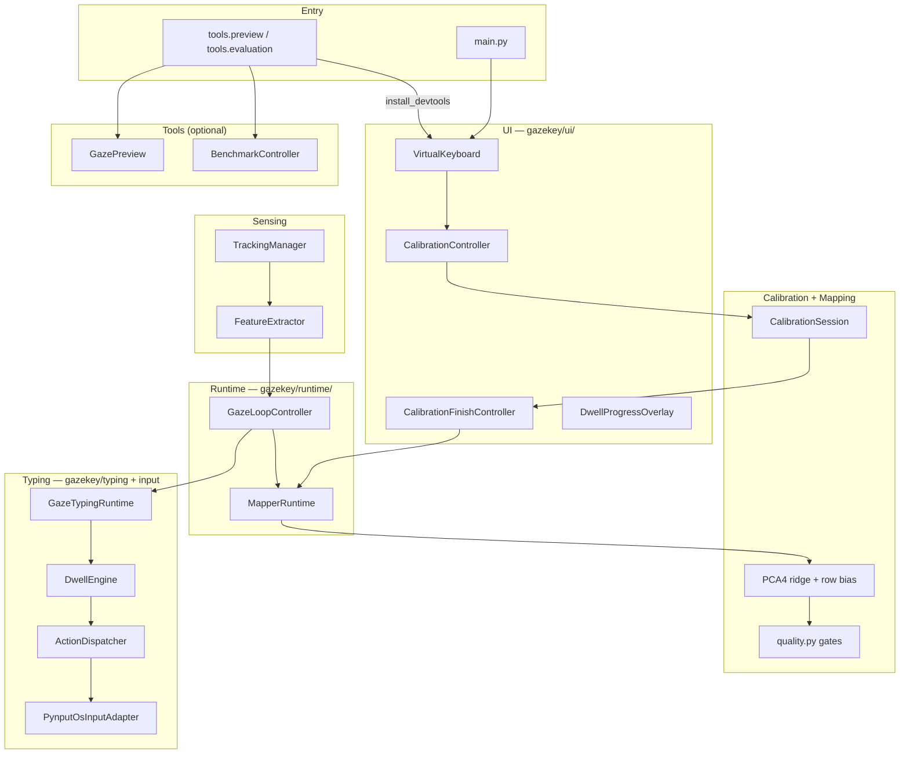

# GazeKey — Project Structure & Critical Flow

**Last updated:** 2026-08-08  
**Scope:** Repository layout and the **product calibrate → mapped gaze → OS typing**
path, plus **tools** preview/benchmark.

Related: [`CURRENT_PIPELINE.md`](./CURRENT_PIPELINE.md),
[`gazekey_code_structure.md`](./gazekey_code_structure.md),
[`../specs/002-gaze-typing-os/plan.md`](../specs/002-gaze-typing-os/plan.md).

---

## 1. System purpose

GazeKey is a **desktop webcam eye-tracking virtual keyboard**. The sealed upstream
question remains:

> After calibration, does mapped gaze land usefully on the virtual keyboard?

Downstream product typing consumes that mapped gaze:

```text
tracking → features → calibration → mapping → mapped gaze
  → key hit-test (keys + suggestion slots) → dwell/click → KeyAction
  → OsInputAdapter → external app
```

Feature **003** adds prefix prediction (`gazekey/prediction/`) **downstream of
mapped gaze only** — no PCA4 / calibration retune. Product keyboard is
letters-only with a fixed 3-slot suggestion bar; developer preview remains
`python -m tools.preview`.

---

## 2. Repository structure

```text
Virtual Keyboard/
├── main.py                          # Product entry
├── requirements.txt
├── gazekey/                         # Product runtime only
│   ├── tracking/
│   ├── features/
│   ├── calibration/
│   ├── mapping/
│   ├── runtime/
│   ├── layout/
│   ├── ui/
│   ├── typing/                      # Dwell, session, KeyAction, dispatcher
│   ├── prediction/                  # WordProvider, TypingContext, suggestions
│   └── input/                       # OsInputAdapter + pynput only
├── tools/                           # Developer preview / evaluation / debug
│   ├── preview/
│   ├── evaluation/
│   ├── debug/
│   ├── flags.py
│   ├── focus_validation.py
│   └── devtools_install.py
├── tests/
├── runs/<session_id>/
├── models/
├── archive/
├── docs/
├── specs/
└── .specify/
```

---

## 3. Layer architecture



---

## 4. Critical product flow

1. `main.py` starts `VirtualKeyboard`.
2. Layout inspector captures key geometry.
3. Tracking thread produces `EyeData`.
4. User completes fullscreen `keyboard15` fixation calibration.
5. `MapperRuntime` fits PCA4 + optional row-Y bias.
6. Quality gates decide usable mapper vs RECALIBRATE.
7. On pass: keyboard returns to **top-half** geometry; typing session auto-starts.
8. Mapped gaze → dwell/mouse → OS injection into the focused external app.
9. Tools (optional): `python -m tools.preview` / `python -m tools.evaluation` — independent of product typing.

---

## 5. Department roles (summary)

| Department | Location | Must own | Must not |
|------------|----------|----------|----------|
| UI shell | `gazekey/ui/` | Orchestration, overlays, dwell visuals | Mapping math, benchmark scoring |
| Calibration | `gazekey/calibration/` | Targets, fixation, quality | Import typing/input; load mappers on startup |
| Mapping | `gazekey/mapping/` | PCA4 fit/predict | Typing “accuracy fixes”; multi-variant switching |
| Runtime | `gazekey/runtime/` | Fit lifecycle, gaze loop wiring | Qt chrome; OS inject details |
| Typing | `gazekey/typing/` | Dwell, session, KeyAction, dispatcher | Change calib/mapping fit |
| OS input | `gazekey/input/` | Adapter boundary; `pynput` containment | Be used from calib/mapping |
| Tools | `tools/` | Preview, benchmark, debug exports | Be imported by `gazekey/` |

---

## 6. Session artifacts

All under `runs/<session_id>/`: `calibration_summary.txt`, `calibration_v2.json`,
`keyboard_layout.csv`, `coverage.json`, debug CSVs, and (tools) benchmark files.

---

## 7. Active vs tools vs archived

| Classification | Paths |
|----------------|-------|
| **Active product** | `main.py`, `gazekey/{tracking,features,calibration,mapping,runtime,layout,ui,typing,input}` |
| **Developer tools** | `tools/{preview,evaluation,debug}`, `tools/flags.py`, `tools/focus_validation.py` |
| **Archived** | `archive/calibration_v1/`, `archive/mapping_variants/` |
| **Governance** | `specs/`, `.specify/` |

Deleted: `gazekey/future|intent|selection`, product preview/benchmark packages,
standalone camera MediaPipe demos under `scripts/`.

---

## 8. Launch options (CLI)

Parsed at entry points into `gazekey/app_config.py`. **No** `GAZEKEY_*` env fallback.

### Product (`python main.py`)

| Option | Effect |
|--------|--------|
| `--verbose` | Detailed logs |
| `--calib-mode <mode>` | Layout override |
| `--calib-debug` | Verbose fixation UI |
| `--gaze-debug` | Extra gaze labels |
| `--camera-preview-during-calib` | Camera during calib |

### Tools

| Option | Effect |
|--------|--------|
| Shared product options | Same on preview/evaluation |
| `--calib-geom-debug` | Post-fit geometry overlay |
| `python -m tools.evaluation` | Implies auto-benchmark |

No product typing enable flag — typing auto-starts when a usable mapper exists.

---

## 9. Design boundaries

| Layer | Must NOT |
|-------|----------|
| **Product `gazekey/`** | Import `tools.*` |
| **UI orchestrator** | Fit mappers or score benchmarks |
| **Calibration / Mapping** | Import `gazekey.input` / dwell / dispatcher |
| **Mapping** | Switch mapper variants at runtime for typing |
| **Tools** | Become required product modes |
| **Typing** | Redesign/reposition keyboard geometry |
