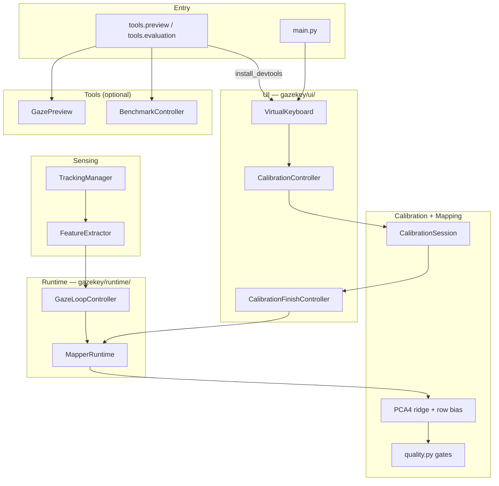

# GazeKey — Project Structure & Critical Flow

**Last updated:** 2026-08-08  
**Scope:** Repository layout and the **product calibrate → usable mapper** path,
plus **tools** preview/benchmark.

Related: [`CURRENT_PIPELINE.md`](./CURRENT_PIPELINE.md),
[`gazekey_code_structure.md`](./gazekey_code_structure.md),
[`../specs/002-gaze-typing-os/plan.md`](../specs/002-gaze-typing-os/plan.md).

---

## 1. System purpose

GazeKey is a **desktop webcam eye-tracking virtual keyboard**. Today the sealed
question remains:

> After calibration, does mapped gaze land usefully on the virtual keyboard?

The active product path is:

```text
tracking → features → calibration → mapping → usable mapper (+ mouse typing)
```

Developer preview and the 15-key benchmark are **tools entries**, not product
modes. Gaze dwell typing and OS injection are specified in `002-gaze-typing-os`
and are not on the default product path yet.

---

## 2. Repository structure

```text
Virtual Keyboard/
├── main.py                          # Product entry
├── requirements.txt
├── gazekey/                         # Product runtime only
│   ├── tracking/
│   ├── features/
│   ├── calibration/
│   ├── mapping/
│   ├── runtime/
│   ├── layout/
│   ├── ui/
│   └── typing/
├── tools/                           # Developer preview / evaluation / debug
│   ├── preview/
│   ├── evaluation/
│   ├── debug/
│   ├── flags.py
│   └── devtools_install.py
├── tests/
├── runs/<session_id>/
├── models/
├── archive/
├── docs/
├── specs/
└── .specify/
```

---

## 3. Layer architecture



---

## 4. Critical product flow

1. `main.py` starts `VirtualKeyboard`.
2. Layout inspector captures key geometry.
3. Tracking thread produces `EyeData`.
4. User completes `keyboard15` fixation calibration.
5. `MapperRuntime` fits PCA4 + optional row-Y bias.
6. Quality gates decide usable mapper vs RECALIBRATE.
7. Mouse typing continues; dwell/OS inject not enabled yet.
8. Tools (optional): preview and/or `GAZEKEY_DEV_BENCHMARK=1` scoring.

---

## 5. Department roles (summary)

| Department | Location | Must own | Must not |
|------------|----------|----------|----------|
| UI shell | `gazekey/ui/` | Orchestration, overlays | Mapping math, benchmark scoring |
| Calibration | `gazekey/calibration/` | Targets, fixation, quality | Load mappers on startup |
| Mapping | `gazekey/mapping/` | PCA4 fit/predict | Multi-variant runtime switching |
| Runtime | `gazekey/runtime/` | Fit lifecycle, gaze loop | Qt chrome |
| Typing helpers | `gazekey/typing/` | Hit test, buffer, smoother | OS inject (later) |
| Tools | `tools/` | Preview, benchmark, debug exports | Be imported by `gazekey/` |

---

## 6. Session artifacts

All under `runs/<session_id>/`: `calibration_summary.txt`, `calibration_v2.json`,
`keyboard_layout.csv`, `coverage.json`, debug CSVs, and (tools) benchmark files.

---

## 7. Active vs tools vs archived

| Classification | Paths |
|----------------|-------|
| **Active product** | `main.py`, `gazekey/{tracking,features,calibration,mapping,runtime,layout,ui,typing}` |
| **Developer tools** | `tools/{preview,evaluation,debug}`, `tools/flags.py` |
| **Archived** | `archive/calibration_v1/`, `archive/mapping_variants/` |
| **Governance** | `specs/`, `.specify/` |

Deleted: `gazekey/future|intent|selection`, product preview/benchmark packages,
standalone camera MediaPipe demos under `scripts/`.

---

## 8. Environment flags

### Product (`gazekey/ui/env_flags.py`)

| Variable | Effect |
|----------|--------|
| `GAZEKEY_VERBOSE=1` | Detailed logs |
| `GAZEKEY_CALIB_MODE` | Layout override (re-evaluate) |
| `GAZEKEY_CALIB_DEBUG=1` | Verbose fixation UI (re-evaluate) |
| `GAZEKEY_GAZE_DEBUG=1` | Extra gaze logs (re-evaluate) |
| `GAZEKEY_CAMERA_PREVIEW_DURING_CALIB=1` | Camera during calib (re-evaluate) |

### Tools (`tools/flags.py`)

| Variable | Effect |
|----------|--------|
| `GAZEKEY_DEV_BENCHMARK=1` | Auto benchmark via `python -m tools.evaluation` |
| `GAZEKEY_CALIB_GEOM_DEBUG=1` | Post-fit geometry overlay |

---

## 9. Design boundaries

| Layer | Must NOT |
|-------|----------|
| **Product `gazekey/`** | Import `tools.*` |
| **UI orchestrator** | Fit mappers or score benchmarks |
| **Calibration** | Load saved mappers on startup |
| **Mapping** | Switch mapper variants at runtime |
| **Tools** | Become required product modes |
