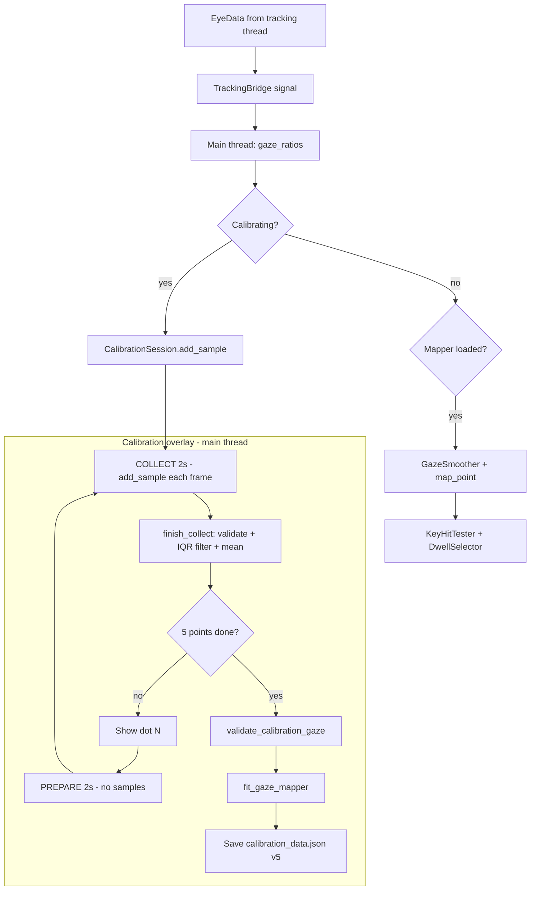

# Calibration logic

This document explains **how** the GazeKey calibration system works—data flow, validation rules, and mapping math. UI wiring lives in `gazekey/ui/virtual_keyboard.py` and `gazekey/ui/calibration_overlay.py`. After calibration, gaze typing uses **dwell** on keys (`gazekey/typing/`), not blink-to-select.

## Core assumption

- The **head stays mostly still** during calibration and use; move **eyes** toward each dot.
- Gaze is inferred from **eye-relative ratios** (iris position inside each eye socket), not raw iris pixels in the frame.
- Ratios follow the same idea as [GazeTracking](https://github.com/antoinelame/GazeTracking) `horizontal_ratio()` / `vertical_ratio()` (see `gaze_features.py`).
- There is **no** sclera left/right split, **no** blink detection, and **no** half-keyboard scanning.

---

## End-to-end logic



---

## 1. Gaze feature (eyes → one point per frame)

**Module:** `gaze_features.py` — `gaze_ratios(eye_data)`

| Step | Logic |
|------|--------|
| 1 | Require `face_detected`, both iris centers, and both eye contour landmark lists. |
| 2 | Per eye: iris offset from eye bbox origin, divided by **eye span minus 12.5% margin** (GazeTracking-style: 10px on an ~80px crop, scaled to each eye’s width/height so **far vs close** faces behave similarly). |
| 3 | Average left and right → `(horizontal_ratio, vertical_ratio)` in roughly **0–1**, clipped. |
| 4 | Return `None` if tracking is incomplete. |

**Semantics (GazeTracking README):** horizontal — right ≈ 0, center ≈ 0.5, left ≈ 1; vertical — top ≈ 0, bottom ≈ 1.

**Legacy:** `average_iris_pixels(eye_data, frame_w, frame_h)` still exists for raw camera pixels but is **not** used for calibration or typing.

**Frame size:** `frame_w` / `frame_h` are passed into the session for compatibility; ratio features do not multiply by frame size. The mapper may still store `frame_w` for legacy affine loads.

---

## 2. Screen target positions (known ground truth)

**Module:** `calibration_session.py` — `compute_calibration_targets(...)`

Five dots in fixed order:

| Index | Name | Screen position |
|-------|------|-----------------|
| 0 | top-left | `(margin, margin)` |
| 1 | top-right | `(width - margin, margin)` |
| 2 | center | `(width/2, height/2)` |
| 3 | bottom-left | `(margin, height - margin)` |
| 4 | bottom-right | `(width - margin, height - margin)` |

`margin = 10%` of screen width/height.

**Two coordinate sets:**

- **Local** — where the overlay **draws** the dot.
- **Global** — stored as `screen_targets` for mapping and JSON (desktop pixels).

---

## 3. Session state machine (per dot)

**Module:** `calibration_session.py` — `CalibrationSession`

### Phases

```
IDLE → PREPARE → COLLECT → (validate + filter) → IDLE → … → DONE
```

| Phase | Duration | Sampling |
|-------|----------|----------|
| `PREPARE` | 2000 ms | **Ignored** — user moves eyes to the dot |
| `COLLECT` | 2000 ms | Every valid frame → `add_sample(gaze_h, gaze_v)` |

Timers run on the **main thread**. Samples arrive from tracking via `VirtualKeyboard` → `overlay.add_sample`.

### After each dot (`finish_collect`)

1. **Per-point validation** on raw samples (below). On failure → `DONE` + error.
2. **IQR outlier filter** (1.5×IQR on X and Y). If fewer than `MIN_SAMPLES` remain → fail with “too many unstable frames after filtering”.
3. **Mean** of filtered samples → append to `_completed_iris_means` (stored as `iris_means` in JSON; values are gaze ratios, not pixels).
4. If index &lt; 5 → next dot; else → `_finalize()`.

Debug: `print` logs how many samples the IQR filter kept per point.

---

## 4. Per-point validation logic

Applied at the end of each dot’s **COLLECT** phase (before IQR filtering).

| Rule | Constant | Logic |
|------|----------|--------|
| Enough frames | `MIN_SAMPLES = 20` | `len(samples) >= 20` |
| Stability | `MAX_SPREAD_RATIO = 0.08` | `max(std(h), std(v)) <= 0.08` over samples |
| Shift from previous dot | `MIN_SHIFT_FROM_PREVIOUS = 0.012` | For dots 2…5: Euclidean distance between **unfiltered** means ≥ 0.012 in ratio space |

Dot 1 has no previous mean.

---

## 5. Global validation logic (all 5 dots)

**Module:** `calibration_validation.py` — `validate_calibration_gaze(...)`

Runs once after all five means are collected, **before** fitting the mapper.

### 5.1 Global span

```
span_h = max(h) - min(h)   across 5 means
span_v = max(v) - min(v)
```

| Check | Threshold |
|-------|-----------|
| Horizontal | `span_h >= 0.015` |
| Vertical | `span_v >= 0.015` |

### 5.2 Corner-to-corner diagonal

```
diagonal = distance(mean[0], mean[4])   # TL vs BR in gaze-ratio space
```

| Check | Threshold |
|-------|-----------|
| TL–BR | `diagonal >= 0.025` |

### 5.3 Consecutive shifts

For `i = 1…4`: distance between consecutive means ≥ `0.012`.

### 5.4 Corner ordering (replaces old correlation check)

| Check | Logic |
|-------|--------|
| Left vs right | Average horizontal ratio at TL+BL differs from TR+BR by ≥ `0.012` |
| Top vs bottom | Average vertical ratio at TL+TR differs from BL+BR by ≥ `0.012` |

Either polarity is accepted (works with mirrored cameras). There is **no** Pearson correlation step.

---

## 6. Mapping logic (gaze ratios → screen pixels)

**Module:** `gaze_mapper.py` — `InterpolationGazeMapper`

### Why interpolation?

Screen dots are far apart; iris/ratio movement in the camera is small. The mapper stores **five (ratio, screen) pairs** and uses **inverse-distance weighting (IDW)** with power 2. At calibration points the map is exact.

### Training data

```
pair[i] = (gaze_ratio_mean[i], screen_target[i])   for i = 0…4
```

### Fit: pick horizontal mirror

Try `flip_x = false` and `true`:

- Stored gaze points use `h` or `1 - h` (ratio space; **not** `frame_w - pixel`).
- Require gaze spread ≥ `MIN_GAZE_SPREAD` (0.015) across the five points.
- Keep orientation with best RMS on pairs (typically ~0 at calibration points).

### Live mapping (`map_point(gaze_h, gaze_v)`)

1. If `flip_x`: `gaze_h ← 1 - gaze_h`.
2. IDW weights `w_k = 1 / d_k²` in **(h, v)** space.
3. Weighted average of screen targets.
4. **Clip** to min/max screen rectangle from the five targets.
5. If clip moves the point by more than `EXTRAPOLATION_WARNING_PX` (50 px), print a throttled warning (at most once per 60 frames).

---

## 7. Persistence logic

**Module:** `calibration_store.py`  
**File:** `calibration_data.json` (project root, usually gitignored)

| Field | Meaning |
|-------|---------|
| `version` | `5` (current) |
| `model` | `"interpolation"` |
| `feature` | `"gaze_ratio"` (required to load) |
| `iris_points` | 5 gaze-ratio points used for IDW (may use flipped H internally) |
| `screen_points` | 5 global screen targets |
| `flip_x`, `frame_w` | Horizontal mirror flag; `frame_w` legacy/auxiliary |
| `screen_targets`, `iris_means` | Raw records (means are gaze ratios) |

**Load rules:**

- Versions **&lt; 5** with interpolation / `iris_points` → rejected; user must recalibrate.
- Legacy models `quadratic`, `normalized_affine`, `separate_linear` → rejected immediately.
- Version 1 **affine** files may still load via `affine_mapper.py`.

---

## 8. Runtime logic (after calibration)

**Module:** `virtual_keyboard.py` + `gazekey/typing/`

| Event | Logic |
|-------|--------|
| Startup | Load JSON → if valid, set `_gaze_mapper` and start tracking. |
| No JSON | Open calibration overlay on first run. |
| Each `EyeData` | `gaze_ratios` → `map_point` → `GazeSmoother` → hit-test key → **dwell ~1.25 s** to activate. |
| CALIBRATE | Clear JSON + mapper → full 5-point flow again. |

**Blinks:** Not detected. A blink may briefly drop tracking; `DwellSelector` tolerates up to 4 missed frames (~130 ms) before resetting dwell progress.

**Thread rule:** Tracking callback only uses `TrackingBridge.forward(eye_data)`. Session, UI, and `map_point` run on the **main thread**.

---

## 9. `CalibrationResult` and diagnostics

**Module:** `calibration_session.py`

| Field | Meaning |
|-------|---------|
| `success` | Whether calibration completed |
| `message` | User-facing status |
| `mapper` | Fitted `InterpolationGazeMapper` if success |
| `screen_targets`, `iris_means` | Five pairs of ground truth |
| `diagnostics` | Optional text: per-point screen error (px) after fit, plus gaze range across dots |

---

## 10. Constants reference

| Constant | Value | File |
|----------|-------|------|
| `PREPARE_MS` | 2000 | `calibration_session.py` |
| `COLLECT_MS` | 2000 | `calibration_session.py` |
| `MIN_SAMPLES` | 20 | `calibration_session.py` |
| `MAX_SPREAD_RATIO` | 0.08 | `calibration_session.py` |
| `MIN_SHIFT_FROM_PREVIOUS` | 0.012 | `calibration_session.py` |
| `MIN_GLOBAL_SPAN_X/Y` | 0.015 | `calibration_validation.py` |
| `MIN_DIAGONAL_SPAN` | 0.025 | `calibration_validation.py` |
| `MIN_CORNER_SEPARATION` | 0.012 | `calibration_validation.py` |
| `MIN_CONSECUTIVE_SHIFT` | 0.012 | `calibration_validation.py` |
| `MIN_GAZE_SPREAD` | 0.015 | `gaze_mapper.py` |
| `EXTRAPOLATION_WARNING_PX` | 50 | `gaze_mapper.py` |
| `IDW_POWER` | 2 | `gaze_mapper.py` |
| `CALIBRATION_VERSION` | 5 | `calibration_store.py` |
| `FEATURE_GAZE_RATIO` | `"gaze_ratio"` | `gaze_mapper.py` |

---

## 11. Module map

| File | Role |
|------|------|
| `gaze_features.py` | `gaze_ratios()`, legacy `average_iris_pixels()` |
| `calibration_session.py` | Dot sequence, IQR filter, per-point + finalize, diagnostics |
| `calibration_validation.py` | Global span, diagonal, corner ordering |
| `gaze_mapper.py` | IDW fit + `map_point` + extrapolation warning |
| `calibration_store.py` | JSON load/save, version and legacy rejection |
| `tracking_bridge.py` | Worker → main thread signal (unchanged) |
| `affine_mapper.py` | Legacy affine (old v1 files only) |

---

## 12. Common failure messages

| Message | Cause |
|---------|--------|
| “only N samples” | Too few frames in COLLECT or face lost. |
| “gaze too unstable” | `std` of ratios &gt; `MAX_SPREAD_RATIO` during one dot. |
| “too many unstable frames after filtering” | IQR removed too many outliers; keep eyes on the dot. |
| “did not move enough from the previous dot” | Ratio shift &lt; `MIN_SHIFT_FROM_PREVIOUS`. |
| “gaze barely moved within the eyes” | Global span &lt; 0.015 on H or V. |
| “not enough difference between top-left and bottom-right” | Diagonal &lt; 0.025. |
| “corner dots did not show enough left/right or up/down” | Corner ordering check failed. |
| “gaze barely changed at all five dots” | IDW fit: spread &lt; `MIN_GAZE_SPREAD` for both flip attempts. |
| “Saved calibration uses outdated gaze model” | JSON version &lt; 5 or missing `feature: gaze_ratio`. |
| “Saved calibration uses legacy model …” | Old quadratic / normalized_affine / separate_linear. |

---

## 13. What this package does *not* do

- Does not implement blink-to-select or sclera-based left/right half-keyboard logic.
- Does not modify `tracking_bridge.py` (by design).
- Does not normalize head pose—only eye-relative ratios.
- Multi-monitor: dots and targets use the geometry passed from the primary screen setup in the UI.

---

## Tests

`tests/test_calibration.py` — gaze ratios, eye-size scaling, validation, session shift rejection, IDW accuracy, JSON roundtrip (v5).
