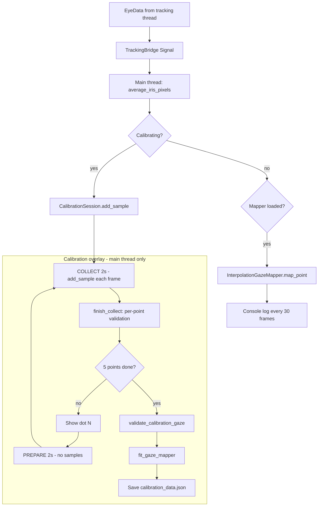

# Calibration logic

This document explains **how** the GazeKey calibration system works—data flow, validation rules, and mapping math. UI wiring lives in `gazekey/ui/virtual_keyboard.py` and `gazekey/ui/calibration_overlay.py`.

## Core assumption

- The **head does not move** during calibration or use.
- **Gaze** is inferred only from **iris position in the camera image** (averaged left + right iris landmarks).
- There is **no** head-pose normalization and **no** eye-relative math—only raw iris pixels in the webcam frame.

---

## End-to-end logic



---

## 1. Gaze feature (iris → one point per frame)

**Module:** `gaze_features.py` — `average_iris_pixels(eye_data, frame_w, frame_h)`

| Step | Logic |
|------|--------|
| 1 | Require `face_detected` and **both** iris centers from MediaPipe. |
| 2 | `norm_x = (left_x + right_x) / 2`, same for Y (normalized 0–1 in image). |
| 3 | `pixel_x = norm_x * frame_w`, `pixel_y = norm_y * frame_h`. |
| 4 | Return `(pixel_x, pixel_y)` or `None` if tracking is incomplete. |

**Frame size:** During calibration, width/height are **locked** to the first camera frame so pixel scale stays consistent. After calibration, the same locked size or latest frame shape is used.

**Why average both eyes:** One stable `(x, y)` gaze feature per frame instead of two separate streams.

---

## 2. Screen target positions (known ground truth)

**Module:** `calibration_session.py` — `compute_calibration_targets(...)`

Five dots in fixed order:

| Index | Name | Screen position |
|-------|------|-----------------|
| 0 | top-left | `(margin, margin)` |
| 1 | top-right | `(width - margin, margin)` |
| 2 | center | `(width/2, height/2)` |
| 3 | bottom-left | `(margin, height - margin)` |
| 4 | bottom-right | `(width - margin, height - margin)` |

`margin = 10%` of screen width/height.

**Two coordinate sets:**

- **Local** `(0 … width, 0 … height)` — where the overlay **draws** the dot.
- **Global** `(screen.x + local_x, …)` — stored as `screen_targets` for mapping and JSON (real desktop pixels).

---

## 3. Session state machine (per dot)

**Module:** `calibration_session.py` — `CalibrationSession`

### Phases

```
IDLE → PREPARE → COLLECT → (validate) → IDLE → … → DONE
```

| Phase | Duration | Sampling |
|-------|----------|----------|
| `PREPARE` | 2000 ms | **Ignored** — user moves eyes to the dot |
| `COLLECT` | 2000 ms | Every valid iris frame → `add_sample(ix, iy)` |

Timers run on the **main thread** (`CalibrationOverlay` + `QTimer`). Samples arrive from the tracking callback via `VirtualKeyboard` → `overlay.add_sample`.

### After each dot (`finish_collect`)

1. Run **per-point validation** (below). On failure → `DONE` + error message.
2. Compute **mean iris** over all samples in the collect window:  
   `mean = (avg(xs), avg(ys))`.
3. Append mean to `_completed_iris_means`.
4. If index &lt; 5 → next dot; else → `_finalize()`.

---

## 4. Per-point validation logic

Applied at the end of each dot’s **COLLECT** phase.

| Rule | Constant | Logic |
|------|----------|--------|
| Enough frames | `MIN_SAMPLES = 20` | `len(samples) >= 20` (~1 s at 30 FPS). |
| Stability | `MAX_SPREAD_PX = 15` | `max(std(x), std(y)) <= 15` over samples—head/iris not jumping. |
| Shift from previous dot | `MIN_SHIFT_FROM_PREVIOUS_PX = 4` | For dot 2…5: `distance(mean, previous_mean) >= 4` px in camera space. |

Dot 1 has no previous mean, so shift is not checked.

**Intent:** Reject empty windows, noisy tracking, and “staring at the same place” between consecutive dots.

---

## 5. Global validation logic (all 5 dots)

**Module:** `calibration_validation.py` — `validate_calibration_gaze(...)`

Runs **once** after all five means are collected, **before** building the mapper.

### 5.1 Global span

```
span_x = max(ix) - min(ix)   across 5 means
span_y = max(iy) - min(iy)
```

| Check | Threshold |
|-------|-----------|
| Horizontal | `span_x >= 10` px |
| Vertical | `span_y >= 8` px |

Fails if the iris barely moved in the camera across the whole routine.

### 5.2 Corner-to-corner diagonal

```
diagonal = distance(iris_mean[0], iris_mean[4])   # TL vs BR in camera
```

| Check | Threshold |
|-------|-----------|
| TL–BR | `diagonal >= 12` px |

Ensures opposite corners produced different iris positions.

### 5.3 Consecutive shifts (again)

For `i = 1…4`: `distance(mean[i], mean[i-1]) >= 4` px.

Same idea as per-point shift, applied to the final means list.

### 5.4 Correlation (did gaze follow screen layout?)

For each orientation `flip_x ∈ {false, true}`:

```
ix = iris_x           OR   ix = frame_w - iris_x
corr_x = correlation(ix, screen_x)
corr_y = correlation(iy, screen_y)
```

| Check | Threshold |
|-------|-----------|
| Horizontal | `|corr_x| >= 0.55` |
| Vertical | `corr_y >= 0.45` |

**Pass** if **either** flip orientation satisfies both.

**Intent:** If you never look at the dots (e.g. stare at center), iris positions won’t correlate with screen left/right and up/down → **calibration fails** even if samples are stable.

**Why `|corr_x|`:** Webcam mirroring may invert left/right; magnitude matters, not sign.

---

## 6. Mapping logic (iris pixels → screen pixels)

**Module:** `gaze_mapper.py` — `InterpolationGazeMapper`

### Why interpolation, not a single formula?

Iris movement in the camera is often only **~10–20 px** while screen dots are **hundreds of px** apart. A global affine or quadratic fit can:

- Fail with huge errors, or
- “Succeed” with nonsense coefficients that explode between dots.

The chosen model stores **five exact correspondences** and interpolates between them.

### Training data (5 pairs)

After validation:

```
pair[i] = (iris_mean[i], screen_target[i])   for i = 0…4
```

### Fit: pick camera X orientation

Try `flip_x = false` and `flip_x = true`:

- Store iris points as `(ix, iy)` or `(frame_w - ix, iy)`.
- Require iris spread `>= 10` px (max of x-span, y-span in iris space).
- Build mapper; at calibration points interpolation is exact (RMS ≈ 0).
- Keep orientation with best RMS (both should be ~0 if data is consistent).

### Live mapping (`map_point`)

Given current iris `(ix, iy)` in camera pixels:

1. If `flip_x`: `ix ← frame_w - ix`.
2. For each calibration point `k` with iris `(px_k, py_k)` and screen `(sx_k, sy_k)`:
   ```
   d_k = hypot(ix - px_k, iy - py_k)
   if d_k ≈ 0: return (sx_k, sy_k)
   w_k = 1 / d_k²
   ```
3. Weighted average:
   ```
   sx = Σ w_k * sx_k / Σ w_k
   sy = Σ w_k * sy_k / Σ w_k
   ```
4. Clip `(sx, sy)` to the min/max screen rectangle from the five targets.

This is **inverse-distance weighting (IDW)** with power 2 (Shepard-style).

**Behavior:**

- At a calibration iris position → returns that dot’s screen position.
- Between dots → smooth blend toward nearby calibration points.
- Outside the “hull” of calibration iris points → still clipped to screen bounds (may be less accurate).

---

## 7. Persistence logic

**Module:** `calibration_store.py`  
**File:** `calibration_data.json` (project root, gitignored)

| Field | Meaning |
|-------|---------|
| `version` | `3` |
| `model` | `"interpolation"` |
| `iris_points` | 5 iris means used for IDW (may use flipped X internally) |
| `screen_points` | 5 global screen targets |
| `flip_x`, `frame_w` | Orientation and scale for `map_point` |
| `screen_targets`, `iris_means` | Raw records for debugging / reload |

**Load rules:**

- Version 1 affine files still load via `affine_mapper.py`.
- Old unstable `quadratic` / bad coefficients → **rejected**; user must recalibrate.

---

## 8. Runtime logic (after calibration)

**Module:** `virtual_keyboard.py`

| Event | Logic |
|-------|--------|
| Startup | Load JSON → if valid, set `_gaze_mapper` and start tracking. |
| No JSON | `QTimer.singleShot(0)` → open calibration overlay. |
| Each `EyeData` | Bridge → main thread → `average_iris_pixels` → if mapper: `map_point` → print **every 30 frames**. |
| CALIBRATE click | Clear JSON + mapper → full 5-point flow again. |

Tracking **never stops** when the overlay closes (needed for continuous gaze).

**Thread rule:** Tracking callback only calls `TrackingBridge.forward(eye_data)`. All UI, session, and `map_point` run on the **main thread**.

---

## 9. Constants reference

| Constant | Value | File |
|----------|-------|------|
| `PREPARE_MS` | 2000 | `calibration_session.py` |
| `COLLECT_MS` | 2000 | `calibration_session.py` |
| `MIN_SAMPLES` | 20 | `calibration_session.py` |
| `MAX_SPREAD_PX` | 15 | `calibration_session.py` |
| `MIN_SHIFT_FROM_PREVIOUS_PX` | 4 | `calibration_session.py` |
| `MIN_GLOBAL_SPAN_X` | 10 | `calibration_validation.py` |
| `MIN_GLOBAL_SPAN_Y` | 8 | `calibration_validation.py` |
| `MIN_DIAGONAL_SPAN` | 12 | `calibration_validation.py` |
| `MIN_CORR_HORIZONTAL` | 0.55 | `calibration_validation.py` |
| `MIN_CORR_VERTICAL` | 0.45 | `calibration_validation.py` |
| `MIN_CONSECUTIVE_SHIFT` | 4 | `calibration_validation.py` |
| `MIN_IRIS_SPREAD` (fit) | 10 | `gaze_mapper.py` |
| `IDW_POWER` | 2 | `gaze_mapper.py` |

---

## 10. Module map

| File | Role in logic |
|------|----------------|
| `gaze_features.py` | Iris averaging + pixel conversion |
| `calibration_session.py` | Dot sequence, phases, per-point validation, finalize |
| `calibration_validation.py` | Global gaze-quality checks |
| `gaze_mapper.py` | IDW fit + `map_point` |
| `calibration_store.py` | JSON load/save |
| `tracking_bridge.py` | Worker → main thread signal |
| `affine_mapper.py` | Legacy affine (v1 files only) |

---

## 11. Common failure messages (logic meaning)

| Message | Cause in logic |
|---------|----------------|
| “only N samples” | COLLECT window too short or face not detected. |
| “too unstable” | `std` of iris samples &gt; 15 px during one dot. |
| “did not move enough from the previous dot” | Per-point shift &lt; 4 px. |
| “iris barely moved” | Global `span_x` or `span_y` too small. |
| “not enough difference between top-left and bottom-right” | Diagonal &lt; 12 px. |
| “did not match the dot positions” | Correlation check failed—you didn’t look where dots appeared. |
| “iris positions were nearly identical at all five dots” | IDW fit: spread &lt; 10 px for both flip attempts. |

---

## 12. What this package does *not* do

- Does not modify `tracking_manager.py`, `video_capture.py`, or `eye_detector.py`.
- Does not move keys or inject typing yet—only maps gaze to screen coordinates and logs them.
- Does not support multi-monitor beyond the primary screen geometry used for dots and targets.

---

## Tests

`tests/test_calibration.py` — unit tests for gaze features, static-gaze rejection, interpolation accuracy, session shift rejection, and JSON roundtrip.
